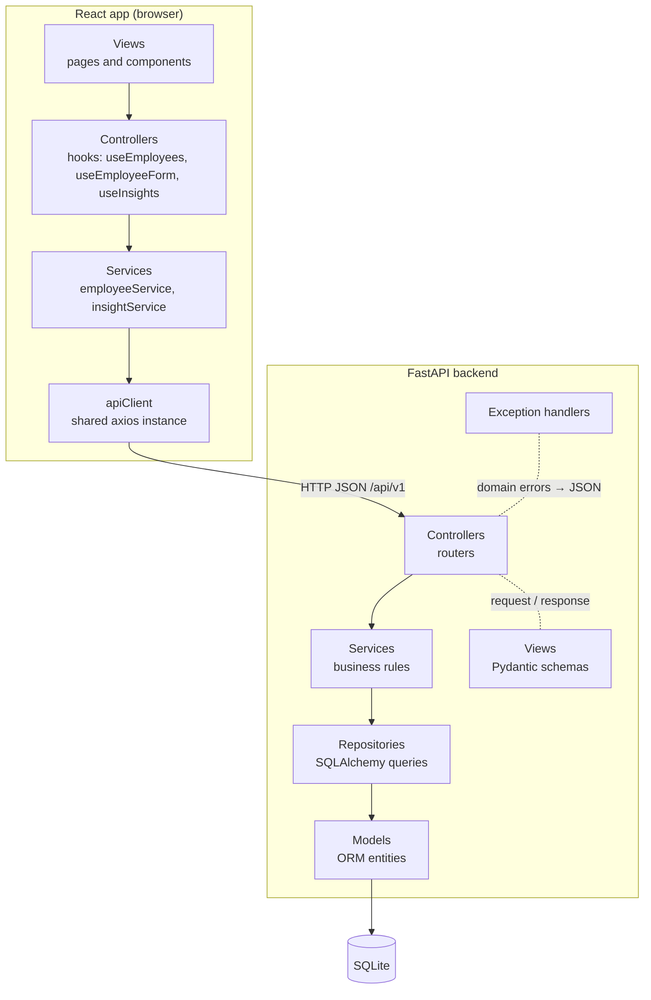

# Design

## Architecture

One deployable service: FastAPI serves the JSON API under `/api/v1` and the built React app for every other path. Both sides follow the same layering, and dependencies only point downwards.

## Backend layers

| Layer | Folder | Responsibility |
|---|---|---|
| Model | `app/models` | SQLAlchemy entities: table shape and indexes only. |
| View | `app/views` | Pydantic request/response schemas. Field-level validation (types, lengths, ranges, allowed values). |
| Controller | `app/controllers` | Parse the request, call one service method, return a view. |
| Service | `app/services` | Cross-field business rules (currency matches country, hire date not in future, unique email), raising domain exceptions. Returns views. |
| Repository | `app/repositories` | All SQL: CRUD, filtering, sorting, pagination and `GROUP BY` aggregations. |
| Exceptions | `app/exceptions` | Domain exceptions and the central handlers that turn them into `{"error": {"code", "message"}}`. |
| Dependencies | `app/dependencies` | `Depends` providers wiring session → repository → service. |

## Frontend layers

| Layer | Folder | Responsibility |
|---|---|---|
| Model | `src/models` | TypeScript types for API data. |
| Service | `src/services` | API calls through the shared axios client. |
| Controller | `src/controllers` | Hooks holding state, loading and errors, calling services. |
| View | `src/views` | Pages and presentational components; render props, call handlers. |

## Data model

`employees`

| Column | Type | Rules |
|---|---|---|
| `id` | integer PK | |
| `full_name` | varchar(100) | 2–100 characters |
| `email` | varchar(254) | unique, valid format, stored lowercase |
| `job_title` | varchar | allowed list |
| `department` | varchar | allowed list |
| `country` | varchar | allowed list |
| `currency` | char(3) | ISO 4217, must equal the country's currency |
| `annual_gross_salary` | numeric(12, 2) | > 0 |
| `hire_date` | date | not in the future |
| `created_at`, `updated_at` | datetime | set automatically |

Indexes: `country`, `job_title`, `department`, and composite (`country`, `job_title`) for the per-country job-title insight.

Money is `Decimal` end to end and serialised as a decimal **string** in JSON (for example `"85000.00"`), so no precision is lost in transit.

## API (`/api/v1`)

| Method | Path | Purpose |
|---|---|---|
| GET | `/health` | Service status |
| GET | `/employees` | Paginated list: `search`, `country`, `department`, `job_title`, `page`, `page_size` (default 20, max 100), `sort_by`, `sort_order` |
| GET | `/employees/{id}` | One employee |
| POST | `/employees` | Create (201) |
| PUT | `/employees/{id}` | Replace all editable fields |
| DELETE | `/employees/{id}` | Delete (204) |
| GET | `/meta/filters` | Distinct countries, departments and job titles present in the data |
| GET | `/meta/reference-data` | Allowed values and the country-to-currency mapping for the form |
| GET | `/insights/countries` | Per country: currency, headcount, min, max, average, plus `usd_rate` and approximate `usd` figures |
| GET | `/insights/job-titles?country=` | Per job title within a country, in local currency and approximate USD |
| GET | `/insights/departments?country=` | Per department within a country, in local currency and approximate USD |
| GET | `/insights/organization` | Organisation-wide headcount, min, max, average in approximate USD |

Every `usd` block carries `rates_as_of`, the date of the fixed rates in `app/constants/currency_constants.py`. USD figures are computed in SQL as `MIN`/`MAX`/`AVG(salary * rate)`, with the rate chosen per row by a `CASE` on currency, so each employee weighs the same in the organisation-wide average. Rounding to cents happens once, in the service.

Errors: `404 NOT_FOUND`, `409 DUPLICATE_EMAIL`, `422 VALIDATION_ERROR`, and `500 INTERNAL_ERROR` for unexpected errors (logged with their traceback; the client gets a generic message), always as `{"error": {"code": "...", "message": "..."}}`.

## Performance

**All the heavy work happens in SQL.** Search, filters, sorting and pagination are part of one query (`WHERE ... ORDER BY ... LIMIT ... OFFSET`) plus a `COUNT` for the total. Only the requested page of rows is loaded into Python. Insight statistics use `GROUP BY` with `COUNT`, `MIN`, `MAX` and `AVG` in `SalaryInsightRepository`, so at most one row per group comes back. That is a few dozen rows, never 10,000.

**Indexes and why each exists**

| Index | Used by |
|---|---|
| `country` | The country filter on the employee list and the per-country `GROUP BY` |
| `department` | The department filter |
| `job_title` | The job-title filter |
| (`country`, `job_title`) | The per-country job-title breakdown. `EXPLAIN QUERY PLAN` shows `SEARCH employees USING INDEX ix_employees_country_job_title (country=?)` |
| `email` (unique) | Duplicate-email checks on create and update |

**`page_size` limit.** The default is 20 and the maximum is 100. Larger values are rejected with 422, so no client can request every row in one call.

**Measured on seeded data.** These figures come from 10,000 seeded employees on a local machine: uvicorn with one process, a SQLite file, one warm-up call, then three timed calls with `curl`.

| Operation | Time |
|---|---|
| Seed 10,000 employees (batched multi-row `INSERT`) | about 1.1 s |
| `GET /employees` (first page) | 3–5 ms |
| `GET /employees` with search + country filter + salary sort | 4–5 ms |
| `GET /employees?page=500` (last page, large `OFFSET`) | 13–16 ms |
| `GET /meta/filters` | 3–4 ms |
| `GET /insights/countries` | about 8 ms |
| `GET /insights/job-titles?country=India` | about 4 ms |
| `GET /insights/departments?country=Germany` | about 3 ms |
| `GET /insights/organization` | about 4 ms |

Deep pages are the slowest because `OFFSET` still scans the skipped rows. Keyset pagination would fix that if the data grew by orders of magnitude.

**Floating-point note.** Salaries and exchange rates are `Decimal` in Python, and rounding to cents happens once, after aggregation. SQLite has no exact decimal type, though, so it computes `salary * rate`, `SUM` and `AVG` in double precision. At this scale the error is far below a cent; an independent check on the seeded data matched an exact `Decimal` calculation to the cent. PostgreSQL `NUMERIC` would make the arithmetic exact. Switching needs only a different `DATABASE_URL`, because the queries are written with SQLAlchemy.

## Extensibility

- **Bonus or other pay components:** add a `compensation_components` table linked to an employee; insights can then sum components in SQL without changing the employee API.
- **Live or historical exchange rates:** replace the rate constants with an `exchange_rates` table keyed by currency and date. The service already receives its rates and date as constructor arguments, so only the provider changes.
